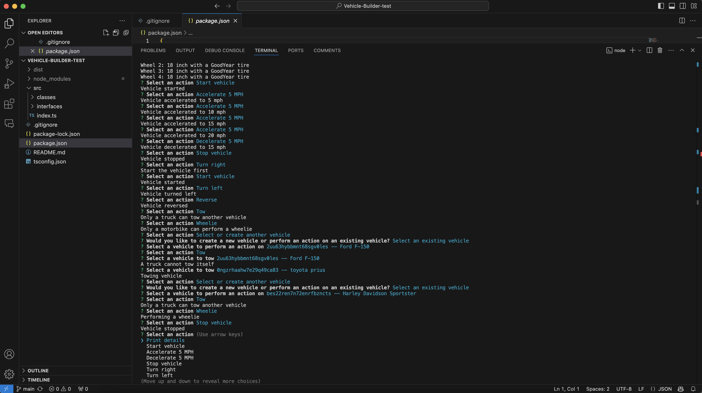

# Vehicle Builder Test

## **Table of Contents**

1. [Description](#description)
2. [Preview](#preview)
3. [Features](#features)
4. [Technologies used](#technologies-used)
5. [Setup Instructions](#setup-instructions)
6. [Walkthrough Video](#walkthrough-video)
7. [Contribution](#contribution)
8. [License](#license)

## Description
This project allows you to create a vehicle or select an existing one from a list of options using the command-line interface. After selecting a vehicle, you can perform various actions with it based on the available options.

## Preview



## Features
- **Create and customize vehicles:** Define unique vehicle attributes.
- **Predefined vehicle selection:** Choose from a list of existing vehicles.
- **Interactive functionality:** Perform actions on your selected vehicle using a simple and intuitive interface.

## Technologies Used
- **TypeScript:** For static typing and code scalability.
- **Node.js:** To power the backend and CLI functionality.
- **Inquirer.js:** For user-friendly command-line prompts.
- **Object-Oriented Programming (OOP):** Classes and methods structure the vehicle logic.

## Setup Instructions
1. Clone the repository:
   ```bash
   git clone <repository-url>
   cd Vehicle-Builder-test
   ```
2. Install dependencies:
   ```bash
   npm install
   ```
3. Run the application:
   ```bash
   npm start
   ```

## Walkthrough Video
For a complete demonstration, watch the [walkthrough video](https://demoair.wondershare.com/dashboard/video/share?id=8bf4a80d-0ceb-40da-a05c-085bb3a584c5).

## Contribution
Contributions are welcome! Feel free to submit a pull request or open an issue for feedback and suggestions.

## License
This project is licensed under the [MIT License](LICENSE).